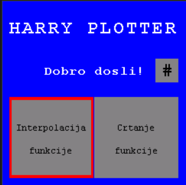
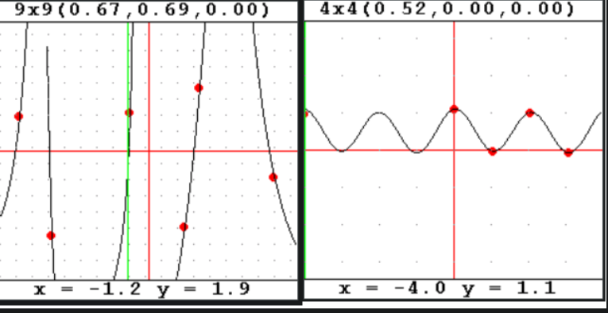
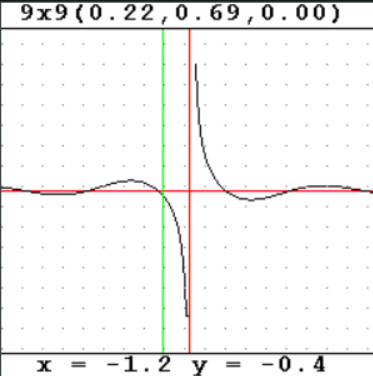

# Harry Plotter

Projekat rađen u sklopu predmeta "Ugradbeni sistemi" kod profesora dr. sc. Samima Konjicije.

Radi se o programu za ugradbeni sistem koji iscrtva zadane funkcije i signale na LCD ekranu u zavisnosti od parametara koji se zadaju putem potenciometara. Pored crtanja unaprijed zadanih funkcija moguce je interpolirati funkciju koja se zadaje putem tacaka preko ekrana osjetljivog na dodir.

Prikaz rada na [linku](https://www.youtube.com/watch?v=UZJlwY9l7bY&t=155s&ab_channel=UgradbeniSistemi).

  

  

## Dokumentacija projekta: “My simple plotter”

Program za iscrtavanje funkcija radi na principu da se za LCD ekran vrši preslikavanje sa intervala realnih brojeva u opsegu \[-a, a) (gdje a predstavlja prirodan broj kao opseg koji se prikazuje u koordinatnom sistemu) na interval \[0, DIM) (gdje je DIM veličina ekrana na koji se vrši iscrtavanje funkcija, u našem slučaju to je 240 piksela).

Funkcije rtpX (engl. real value to pixel) i rtpY za preslikavanje iz realnih brojeva u prirodne brojeve.
Funkcija ptrX ( engl. pixel value to real) vrši inverziju, odnosno prirodni broj preslikava u realne brojeve. Navedene funkcije predstavljene su na slici 1.

Program vrši iscrtavanje funkcije po principu da klasa “Plotter” ima atribut function (koji je tip polimorfni funkcijski omotač) koji sadrži željenu funkciju. Pozivom metode draw za zadatu funkciju se kreira vektor objekata “Pixel” pomoću metode values.

Metoda values za svaki piksel na apscisnoj osi uzima odgovarajuću vrijednost za x koordinatu u Dekartovom koordinatnom sistemu i vrši računanje vrijednosti funkcije. Dobijenu vrijednost pretvara u diskretnu vrijednost za odgovarajući piksel na ekranu i pohranjuje tačke u vektor.
Metoda draw, nakon dobijenog vektora “Pixela”, prosto iscrtava linije spojene tačkama.

Interpoliranje funkcije zadanim tačkama vrši se putem Interpolator klasa. Kreirana je apstraktna klasa “AbstractInterpolator” iz koje su naslijeđene klase za specifične tipove interpolacije, kao što su:
* Linearna LinearInterpolator (vrijednost je dobijena kao linearna funkcija intervala kojem pripada tražena tačka) \[1],
* Polinomska (dio po dio) PiecewisePolynomialInterpolator (pronalazi odgovarajuće polinomske funkcije po dijelovima koji najbolje odgovaraju tačkama interpolacije) \[1],
* Trigonometrijska TrigonometricInterpolator (interpolacija kreira periodične funkcije na osnovu Fourierovog reda sa konačno mnogo članova) \[1],
* Baricentrična BarycentricInterpolator (vrši racionalnu interpolaciju funkcije kao količnik dva polinoma u specijalnom baricentričnom obliku) \[1],
* Spline SplineInterpolator (specijalna polinomska interpolacija polinomom niskog reda sa uslovima neprekidnosti izvoda u tačkama interpolacije) \[1].
Algoritmi za interpolacije su pisani na osnovu algoritama iz knjige “Numerički algoritmi” Prof. Dr. Sc. Željka Jurića.

  

Kreiranje instance interpolatora vrši sortiranje tačaka, po x koordinati, zbog zahtjeva određenih interpolacija za sortiranim tačkama i brze binarne pretrage. Klase imaju preklopljene operatore() (malih zagrada), pa se ponašaju kao funkcijski objekti.

Interpolacija funkcioniše na principu da se pri zadavanju tačaka kreira instanca odabranog interpolatora i dodijeli polimorfnom pokazivaču koji se koristi u funkciji get_interpolate koja se može poslati objektu Plotter kako bi se vrsilo crtanje funkcije.

Funkcije koje su ponuđene za crtanje su:
* Sinus: a۰sin(bx+c),
* Cosinus:  a۰cos(bx + c),
* Sinc: a۰sin(bx + c) / x,
* Signal testera: a - (2a)/PI۰atan(1. /tan((PI۰x) / b)),
* Signal trokut: a۰acos(cos(bx + c)),
* Signal četvrtke,
* Eksponencijalna: a۰b^(x + c),
* Logaritamska: a۰log(b۰x) + c,
* Linearna: a۰x + b,
* Kvadratna: a۰x^2 + b۰x + c,
* Kubna: a۰x^3 + b۰x^2 + c۰x,
* Recipročna funkcija: a / x + b.

  

U navedenim izrazima a, b i c predstavljaju parametre čije se vrijednosti zadaju putem potenciometara i za svaku funkciju se posebno adaptiraju kako bi prikazani graf bio reprezentativan.

Za korisnički interfejs (engl. user interface) su kreirane displej funkcije koje predstavljaju poglede na glavnom ekranu i ispisuju poruke i upute. Također tu su funkcije koje na osnovu trenutnog stanja potenciometra i funkcija prekida (engl. interrupt) prelaze u sljedeće stanje.

Vrlo su važne funkcije parametars_change i scale_change. “Plotter” prilikom prvog pokretanja crtanja funkcije izračuna i kešira tačke koje treba iscrtavati i nakon toga uzima keširane tačke, jedino ukoliko dođe do promjene parametara ili razmjere je potrebno ponovo računati nove vrijednosti.

Reference:
[1] “Numerički algoritmi”, Željko Jurić, Univerzitet u Sarajevu, 2018.
