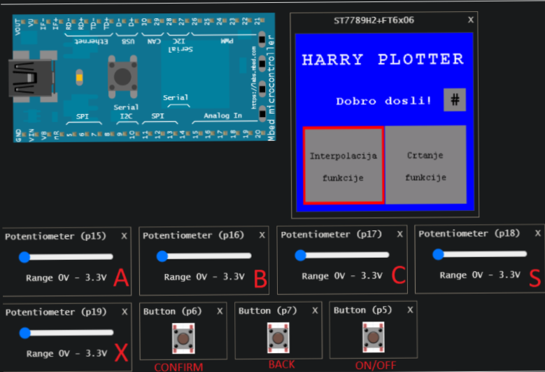

# Harry Plotter

The project was carried out as part of the course "Ugradbeni sistemi" (Embeded systems) by professor Ph.D. Samim Konjicija.

It is a program for a built-in system that plots the default functions and signals on the LCD screen depending on the parameters set via potentiometers. In addition to drawing preset functions, it is possible to interpolate a function that is set via points via the touch screen.

Presentation of work at [link](https://www.youtube.com/watch?v=UZJlwY9l7bY&ab_channel=UgradbeniSistemi).

   

   

## Project documentation: "My simple plotter"

The function plotting program works on the principle that the LCD screen is mapped from the interval of real numbers in the range \[-a, a) (where a represents a natural number as the range displayed in the coordinate system) to the interval \[0, DIM) (where DIM is the size of the screen on which the functions are drawn, in our case it is 240 pixels).

Functions rtpX (eng. real value to pixel) and rtpY for mapping from real numbers to natural numbers.
The ptrX (pixel value to real) function performs inversion, i.e. maps natural numbers into real numbers. The mentioned functions are presented in Figure 1.

The program plots the function according to the principle that the "Plotter" class has the function attribute (which is a polymorphic function wrapper type) that contains the desired function. By calling the draw method for the given function, a vector of "Pixel" objects is created using the values method.

The values method for each pixel on the abscissa axis takes the corresponding value for the x coordinate in the Cartesian coordinate system and calculates the value of the function. It converts the obtained value into a discrete value for the corresponding pixel on the screen and stores the points in a vector.
The draw method, after obtaining the "Pixel" vector, simply draws lines connected by dots.

Interpolation of the function with given points is done through the Interpolator class. An abstract class "AbstractInterpolator" was created, from which classes for specific types of interpolation are inherited, such as:
* Linear LinearInterpolator (the value is obtained as a linear function of the interval to which the requested point belongs) \[1],
* Polynomial (piece by piece) PiecewisePolynomialInterpolator (finds the corresponding piecewise polynomial functions that best match the interpolation points) \[1],
* Trigonometric TrigonometricInterpolator (interpolation creates periodic functions based on the Fourier series with finitely many terms) \[1],
* Barycentric BarycentricInterpolator (performs rational interpolation of a function as a quotient of two polynomials in a special barycentric form) \[1],
* Spline SplineInterpolator (special polynomial interpolation with a low-order polynomial with conditions of continuity of derivatives at the interpolation points) \[1].
Algorithms for interpolations were written based on the algorithms from the book "Numerical Algorithms" by Prof. dr. Sc. Željko Jurić.

   

Creating an interpolator instance sorts the points, by x coordinate, due to the requirement of certain interpolations for sorted points and fast binary search. Classes have overlapping operators() (small brackets), so they behave like function objects.

Interpolation works on the principle that when assigning points, an instance of the selected interpolator is created and assigned to a polymorphic pointer used in the get_interpolate function, which can be sent to the Plotter object in order to draw the function.

The functions offered for drawing are:
* Sine: a۰sin(bx+c),
* Cosine: a۰cos(bx + c),
* Sinc: a۰sin(bx + c) / x,
* Tester signal: a - (2a)/PI۰atan(1. /tan((PI۰x) / b)),
* Signal triangle: a۰acos(cos(bx + c)),
* Thursday signal,
* Exponential: a۰b^(x + c),
* Logarithmic: a۰log(b۰x) + c,
* Linear: a۰x + b,
* Quadratic: a۰x^2 + b۰x + c,
* Cubic: a۰x^3 + b۰x^2 + c۰x,
* Reciprocal function: a / x + b.

   

In the mentioned expressions, a, b and c represent parameters whose values are set via potentiometers and are specially adapted for each function so that the displayed graph is representative.

Display functions were created for the user interface, which represent views on the main screen and print messages and instructions. There are also functions that move to the next state based on the current state of the potentiometer and the interrupt function.

The parameters_change and scale_change functions are very important. "Plotter" when starting the plotting function for the first time calculates and caches the points to be plotted and after that takes the cached points, only if there is a change in parameters or scales, it is necessary to recalculate the new values.
Více o zdrojovém textuPro další informace o překladu je potřeba zdrojový text
Odeslat zpětnou vazbu
Postranní panely

# Harry Plotter

Projekat rađen u sklopu predmeta "Ugradbeni sistemi" kod profesora dr. sc. Samima Konjicije.

Radi se o programu za ugradbeni sistem koji iscrtva zadane funkcije i signale na LCD ekranu u zavisnosti od parametara koji se zadaju putem potenciometara. Pored crtanja unaprijed zadanih funkcija moguce je interpolirati funkciju koja se zadaje putem tacaka preko ekrana osjetljivog na dodir.

Prikaz rada na [linku](https://www.youtube.com/watch?v=UZJlwY9l7bY&ab_channel=UgradbeniSistemi).

  

  

## Dokumentacija projekta: “My simple plotter”

Program za iscrtavanje funkcija radi na principu da se za LCD ekran vrši preslikavanje sa intervala realnih brojeva u opsegu \[-a, a) (gdje a predstavlja prirodan broj kao opseg koji se prikazuje u koordinatnom sistemu) na interval \[0, DIM) (gdje je DIM veličina ekrana na koji se vrši iscrtavanje funkcija, u našem slučaju to je 240 piksela).

Funkcije rtpX (engl. real value to pixel) i rtpY za preslikavanje iz realnih brojeva u prirodne brojeve.
Funkcija ptrX ( engl. pixel value to real) vrši inverziju, odnosno prirodni broj preslikava u realne brojeve. Navedene funkcije predstavljene su na slici 1.

Program vrši iscrtavanje funkcije po principu da klasa “Plotter” ima atribut function (koji je tip polimorfni funkcijski omotač) koji sadrži željenu funkciju. Pozivom metode draw za zadatu funkciju se kreira vektor objekata “Pixel” pomoću metode values.

Metoda values za svaki piksel na apscisnoj osi uzima odgovarajuću vrijednost za x koordinatu u Dekartovom koordinatnom sistemu i vrši računanje vrijednosti funkcije. Dobijenu vrijednost pretvara u diskretnu vrijednost za odgovarajući piksel na ekranu i pohranjuje tačke u vektor.
Metoda draw, nakon dobijenog vektora “Pixela”, prosto iscrtava linije spojene tačkama.

Interpoliranje funkcije zadanim tačkama vrši se putem Interpolator klasa. Kreirana je apstraktna klasa “AbstractInterpolator” iz koje su naslijeđene klase za specifične tipove interpolacije, kao što su:
* Linearna LinearInterpolator (vrijednost je dobijena kao linearna funkcija intervala kojem pripada tražena tačka) \[1],
* Polinomska (dio po dio) PiecewisePolynomialInterpolator (pronalazi odgovarajuće polinomske funkcije po dijelovima koji najbolje odgovaraju tačkama interpolacije) \[1],
* Trigonometrijska TrigonometricInterpolator (interpolacija kreira periodične funkcije na osnovu Fourierovog reda sa konačno mnogo članova) \[1],
* Baricentrična BarycentricInterpolator (vrši racionalnu interpolaciju funkcije kao količnik dva polinoma u specijalnom baricentričnom obliku) \[1],
* Spline SplineInterpolator (specijalna polinomska interpolacija polinomom niskog reda sa uslovima neprekidnosti izvoda u tačkama interpolacije) \[1].
Algoritmi za interpolacije su pisani na osnovu algoritama iz knjige “Numerički algoritmi” Prof. Dr. Sc. Željka Jurića.

  

Kreiranje instance interpolatora vrši sortiranje tačaka, po x koordinati, zbog zahtjeva određenih interpolacija za sortiranim tačkama i brze binarne pretrage. Klase imaju preklopljene operatore() (malih zagrada), pa se ponašaju kao funkcijski objekti.

Interpolacija funkcioniše na principu da se pri zadavanju tačaka kreira instanca odabranog interpolatora i dodijeli polimorfnom pokazivaču koji se koristi u funkciji get_interpolate koja se može poslati objektu Plotter kako bi se vrsilo crtanje funkcije.

Funkcije koje su ponuđene za crtanje su:
* Sinus: a۰sin(bx+c),
* Cosinus:  a۰cos(bx + c),
* Sinc: a۰sin(bx + c) / x,
* Signal testera: a - (2a)/PI۰atan(1. /tan((PI۰x) / b)),
* Signal trokut: a۰acos(cos(bx + c)),
* Signal četvrtke,
* Eksponencijalna: a۰b^(x + c),
* Logaritamska: a۰log(b۰x) + c,
* Linearna: a۰x + b,
* Kvadratna: a۰x^2 + b۰x + c,
* Kubna: a۰x^3 + b۰x^2 + c۰x,
* Recipročna funkcija: a / x + b.

  

U navedenim izrazima a, b i c predstavljaju parametre čije se vrijednosti zadaju putem potenciometara i za svaku funkciju se posebno adaptiraju kako bi prikazani graf bio reprezentativan.

Za korisnički interfejs (engl. user interface) su kreirane displej funkcije koje predstavljaju poglede na glavnom ekranu i ispisuju poruke i upute. Također tu su funkcije koje na osnovu trenutnog stanja potenciometra i funkcija prekida (engl. interrupt) prelaze u sljedeće stanje.

Vrlo su važne funkcije parametars_change i scale_change. “Plotter” prilikom prvog pokretanja crtanja funkcije izračuna i kešira tačke koje treba iscrtavati i nakon toga uzima keširane tačke, jedino ukoliko dođe do promjene parametara ili razmjere je potrebno ponovo računati nove vrijednosti.

Reference:
[1] “Numerički algoritmi”, Željko Jurić, Univerzitet u Sarajevu, 2018.
